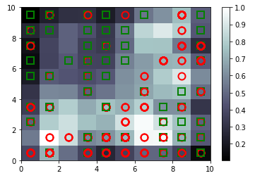

#### Self-Organizing Feature Map to Uncover Automobile Bodily Injury Claims Fraud

Use SOMs (Self Organizing Maps) to predict which claims are potentially fraud for autombile claims injury, based on this paper [here](http://citeseerx.ist.psu.edu/viewdoc/download?doi=10.1.1.195.1161&rep=rep1&type=pdf)

Picture of a SOM exposing fraudulent automabile injury claims:

 

* Annual cost of the insurance fraud problem is $20 billion
* Insurance fraud in health insurance represented $550 billion
* The Insurance Research Council report on automobile insurance fraud stated that “the excess injury payments as a result of fraud and/or buildup are estimated to be between 17 and 20 percent of total paid losses, or $5.2 to $6.3 billion

